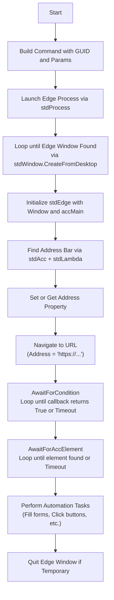
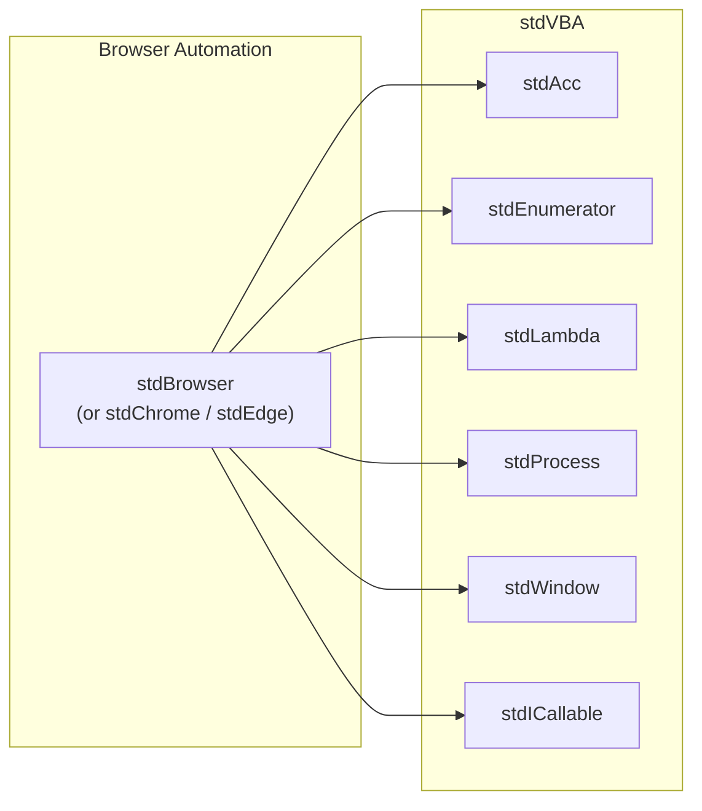

<!--
    {
        "description": "Automate the web with Chrome",
        "tags":["web", "automation", "accessibility"],
        "deps":["stdAcc", "stdEnumerator", "stdLambda", "stdProcess", "stdWindow", "stdICallable"]
    }
-->
# Browser Automation with stdVBA

On 15th June 2022, Internet explorer officially retires as an application. It is uncertain what will happen when this occurs, however many users of VBA rely heavily on Internet Explorer to automate web reports etc. 

This is a stdVBA solution which uses accessibility APIs and Google Chrome to perform web automation.

## Requirements

* [stdVBA](http://github.com/sancarn/stdVBA)
    * stdAcc
    * stdEnumerator
    * stdLambda
    * stdProcess
    * stdWindow
    * stdICallable

* Currently only works on Windows OS

## Usage

* Add a reference to `stdChrome.xlsm` (or import the necessary files; or open the supplied workbook)
* Call `stdChrome.create()` to create a new instance of the chrome object.
* Happy coding

## Roadmap

* [X] Can create new
* [X] Can create from existing
* [ ] Can run Javascript (may not be possible with existing; will likely need chrome DevTools protocol).
* [ ] Can set the HTML of the browser. (2 options: run a http server with VBA, or navigate to a html file (may have CORS issues))
* [ ] Hide address bar for business apps
* [X] Can `Navigate()` / `Get/Let Address`
* [X] Can `Quit`.
* [ ] A better way to await loading would be nice.

## Known issues

* [ ] `stdWindow`/`stdAcc` errors can be annoying. In most cases it boils down to an issue of approach, but sometimes it can be race conditions... This needs to be worked out better in `stdVBA`, see some of the examples for best practice approaches.

## Similar projects

* [Chrome DevProtocol](https://github.com/PerditionC/VBAChromeDevProtocol) - stdVBA wants to have a `stdBrowser` which interacts with browser devtool protocols; however this repo is already most of the way there! With this library you'll be able to control browsers on a deeper level and gain the ability to execute javascript for instance.

## High Level Process

A typical high level process for an ArcGIS automation example.

## Project Structure

