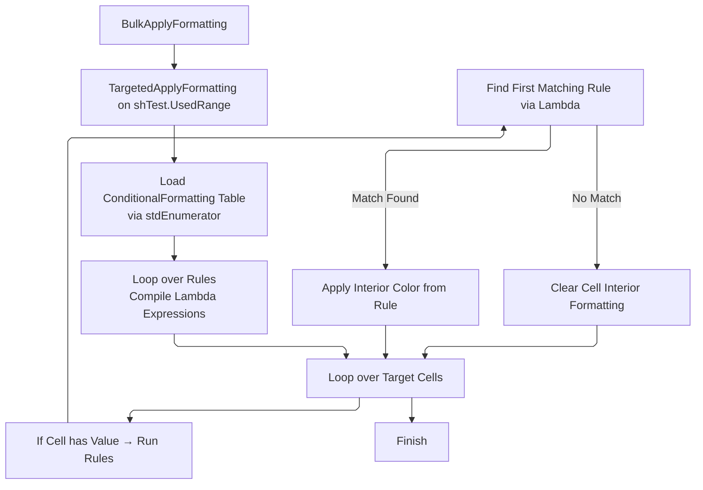
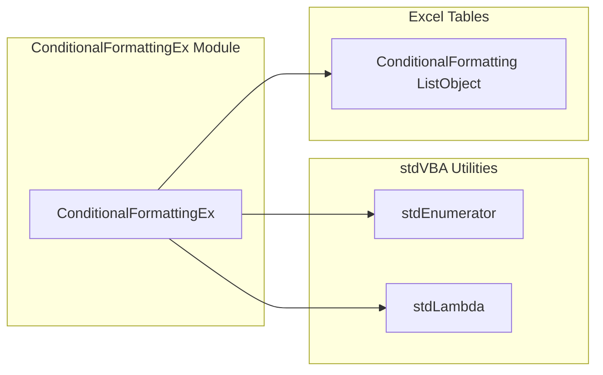

# Conditional Formatting using stdLambda

A very simple demo, one of the sheets contains a lookup table:

This list object is then iterated through whenever a cell changes on `ConditionalFormattingSheet`:

## High Level Process

## Project Structure

