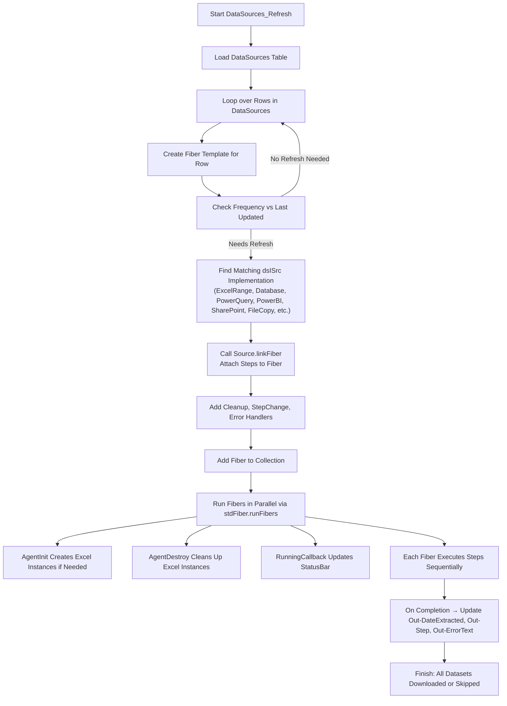
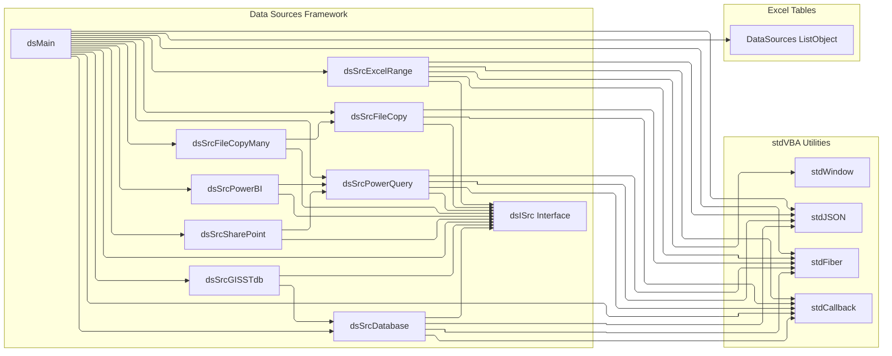

## High Level Process

```mermaid
flowchart TD
    A[Start DataSources_Refresh] --> B[Load DataSources Table]
    B --> C[Loop over Rows in DataSources]
    C --> D[Create Fiber Template for Row]
    D --> E[Check Frequency vs Last Updated]
    E -->|Needs Refresh| F["Find Matching dsISrc Implementation<br/>(ExcelRange, Database, PowerQuery, PowerBI, SharePoint, FileCopy, etc.)"]
    F --> G[Call Source.linkFiber<br/>Attach Steps to Fiber]
    G --> H[Add Cleanup, StepChange, Error Handlers]
    H --> I[Add Fiber to Collection]
    E -->|No Refresh Needed| C

    I --> J[Run Fibers in Parallel via stdFiber.runFibers]
    J --> K[AgentInit Creates Excel Instances if Needed]
    J --> L[AgentDestroy Cleans Up Excel Instances]
    J --> M[RunningCallback Updates StatusBar]
    J --> N[Each Fiber Executes Steps Sequentially]
    N --> O[On Completion → Update Out-DateExtracted, Out-Step, Out-ErrorText]
    O --> P[Finish: All Datasets Downloaded or Skipped]
```

## Project Structure

```mermaid
%%{init: {"flowchart": {"defaultRenderer": "elk"}} }%%
flowchart LR
    linkStyle default interpolate linear

    subgraph BaseLibraries[stdVBA Utilities]
        SF[stdFiber]
        SJ[stdJSON]
        SCB[stdCallback]
        SW[stdWindow]
    end

    subgraph ExcelTables[Excel Tables]
        TDS[DataSources ListObject]
    end

    subgraph DataSourcesFramework[Data Sources Framework]
        DM[dsMain]
        DI[dsISrc Interface]
        DXR[dsSrcExcelRange]
        DDB[dsSrcDatabase]
        DGC[dsSrcGISSTdb]
        DPQ[dsSrcPowerQuery]
        DPB[dsSrcPowerBI]
        DSP[dsSrcSharePoint]
        DFC[dsSrcFileCopy]
        DFM[dsSrcFileCopyMany]
    end

    %% Main orchestrator
    DM --> TDS
    DM --> DI
    DM --> SF
    DM --> SJ
    DM --> SCB

    %% dsMain connects to all source types
    DM --> DXR
    DM --> DDB
    DM --> DGC
    DM --> DPQ
    DM --> DPB
    DM --> DSP
    DM --> DFC
    DM --> DFM

    %% Implementations implement dsISrc
    DXR --> DI
    DDB --> DI
    DGC --> DI
    DPQ --> DI
    DPB --> DI
    DSP --> DI
    DFC --> DI
    DFM --> DI

    %% Dependencies
    DXR --> SF
    DXR --> SJ
    DXR --> SCB
    DXR --> SW

    DDB --> SF
    DDB --> SJ
    DDB --> SCB

    DGC --> DDB

    DPQ --> SF
    DPQ --> SJ
    DPQ --> SCB

    DPB --> DPQ

    DSP --> DPQ

    DFC --> SF
    DFC --> SCB

    DFM --> DFC
```