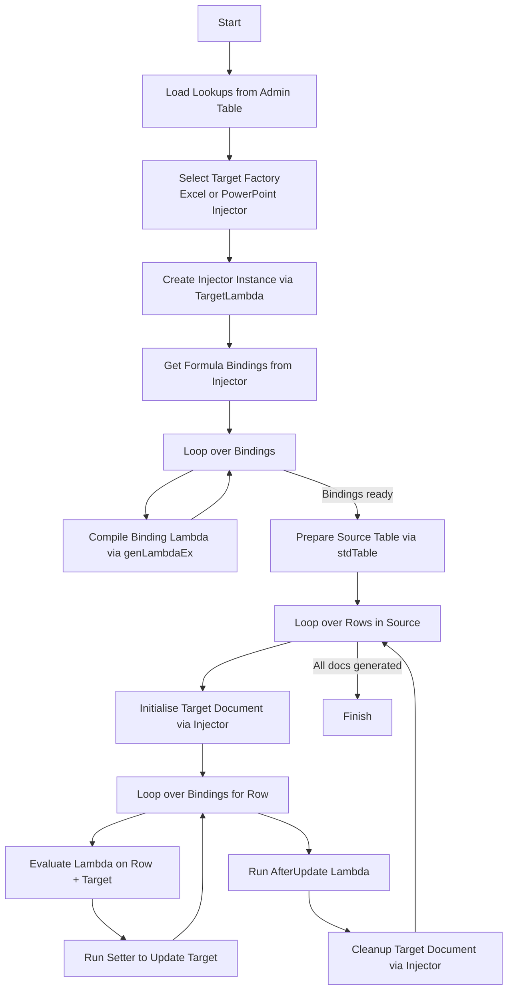
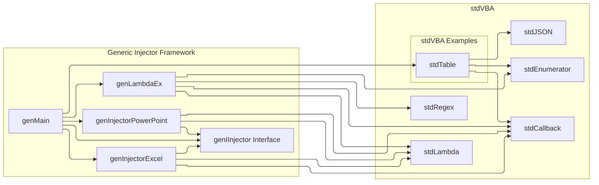

# Document Generator

This example demonstrates how to generate documents from a template document and a tabular data source.

## Requirements

* stdVBA
    * stdArray
    * stdCallback
    * stdCOM
    * stdICallable
    * stdLambda
    * stdReg
    * stdShell
    * stdWindow
* Currently only works on Windows OS

## Usage

## High Level Process

## Project Structure

