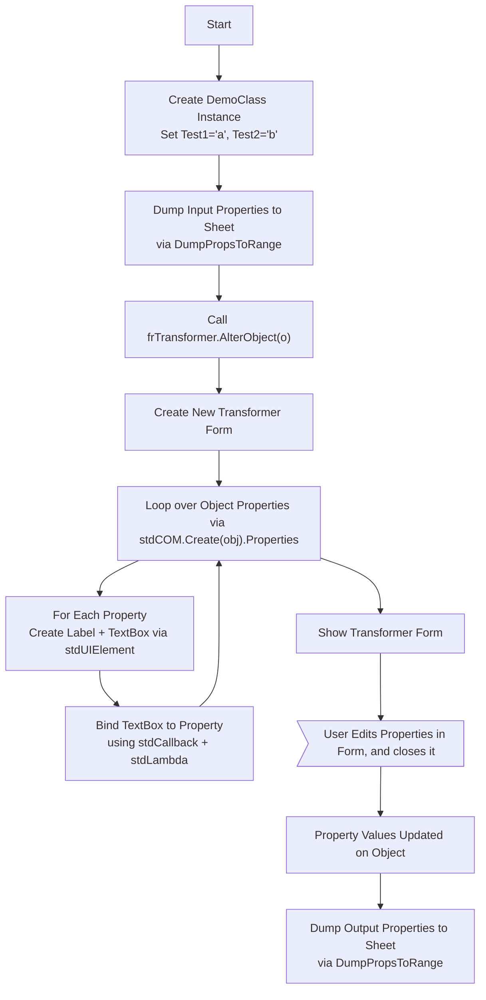
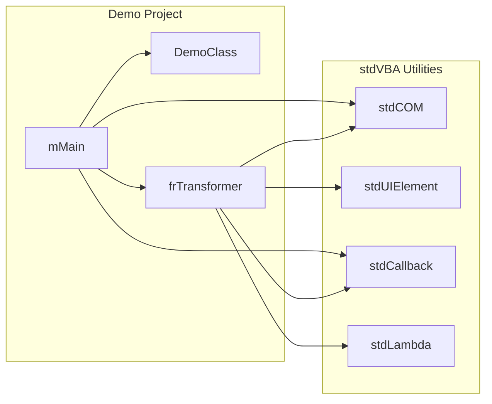

# Dynamic Form sample - Transform an object

Sometimes it is required to generate the contents of a userform on-demand (at runtime). This sample gives an example of one such case. The key function in play is `frTransformer.AlterObject` which displays a form to the user containing all the properties of the object passed into it. As the user changes the values in the userform the values are automatically updated back in the object. When the user closes the form the values are read back out to the worksheet (outputted to F2)

```vb
Sub TestAlterObject()
  Dim o As DemoClass: Set o = New DemoClass
  o.Test1 = "a"
  o.Test2 = "b"
  
  'Dump input data to sheet
  Call DumpPropsToRange(o, shDemo.Range("A2"))
  
  'Show form and change object
  Call frTransformer.AlterObject(o)
  
  'Dump output data to sheet
  Call DumpPropsToRange(o, shDemo.Range("F2"))
End Sub
```

`stdVBA` makes this an easy job by simplifying what would be hundreds of lines of code down to 10 or so:

```vb
Public Function AlterObject(ByVal obj As Object) As Object
  Dim ctrls As Collection: Set ctrls = New Collection
  Dim oForm As frTransformer: Set oForm = New frTransformer
  Dim index As Long: index = -2
  Dim prop
  For Each prop In stdCOM.Create(obj).Properties
    index = index + 2
    ctrls.add stdUIElement.CreateFromType(oForm.controls, uiLabel, prop & "_label", prop, fTop:=index * 20)
    ctrls.add stdUIElement.CreateFromType(oForm.controls, uiTextBox, prop & "_field", , CallByName(obj, prop, VbGet), _
      stdLambda.Create("if $3 = EUIElementEvent.uiElementEventKeyUp then let $1." & prop & " = $2.value end").Bind(obj), _ 
      fTop:=(index + 1) * 20)
  Next
  oForm.Show
  Set AlterObject = obj
End Function
```


## High Level Process



## Project Structure

