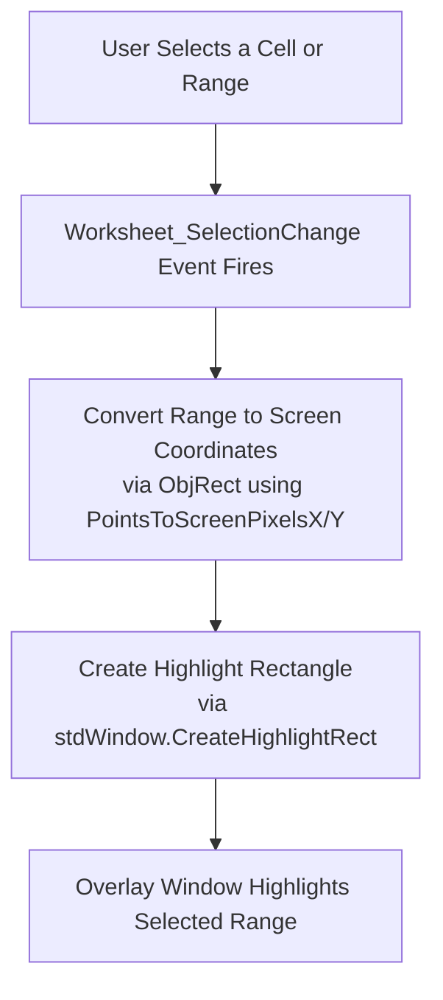
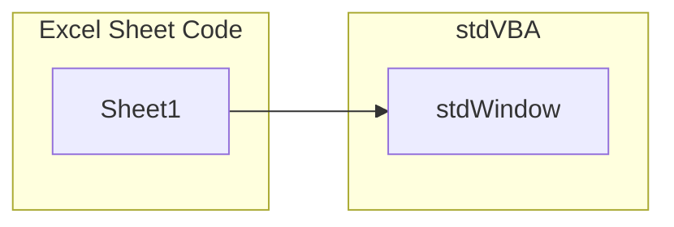

# Highlight Selected Cells

This example demonstrates how to highlight the selected cells in a spreadsheet using `stdWindow.CreateHighlightRect`.

## Requirements

* stdVBA
    * stdWindow
    * stdICallable
* Currently only works on Windows OS

## Usage

Open the attached xlsm demo, and highlight the cells in the spreadsheet.

## High Level Process

## Project Structure

