<!--
    {
        "description": "Accessibility Inspector",
        "tags":["ui", "window", "automation", "embedding"],
        "deps":["stdAcc", "stdProcess", "stdWindow", "stdICallable"]
    }
-->

# Accessibility Inspector

While using `stdAcc` it is often useful to be able to obtain the accessibility information at the cursor. This can help you find elements to further investigate the accessibility tree. This example provides a utility application which can be used to:

* Pinpoint element attributes to assist during automation.
* Allows setting of `accValue`, typically useful to test setting fields with information.
* Allows execution of `DoDefaultAction`.

## Requirements

* [stdVBA](http://github.com/sancarn/stdVBA)
    * stdAcc
    * stdWindow
    * stdICallable
* Currently only works on Windows OS

## Usage

Open xlsm and click launch!

Move your mouse around to extract accessibility information

## Roadmap

* [X] Extract basic accessibility information
* [X] Provide a button to freeze time, allowing the copy and paste of data out of the form.
* [X] Make form topmost
* [ ] FIXME: Slow path creation over Excel.
* [ ] Option to highlighting the hovered accessibility element with a yellow rect created with GDI+ to help indicate which window is being inspected.
* [ ] Display the accessibility tree in a treeview control. Navigating the tree should navigate the inspected element and navigate "hover rectangle" above - this will likely be a different project.

## Known issues

* Path field has currently been disabled. See roadmap.

## High Level Process

```mermaid
flowchart TD
    A[Launch AccHelper Form] --> B[Form Shows and Watch Loop Starts]

    B --> C[Capture Element via stdAcc.CreateFromMouse]
    C --> D[Update UI with Element Properties]

    D --> E[User Can Perform Actions<br/>SetValue or DoDefaultAction]
    E --> B

    B --> F[If Temporary Mode Active<br/>Stop After 5s]
    F --> B

    B --> G[User Closes Form → Exit]
```

## Project Structure

