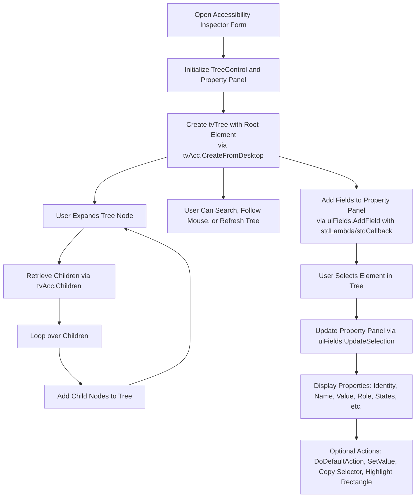
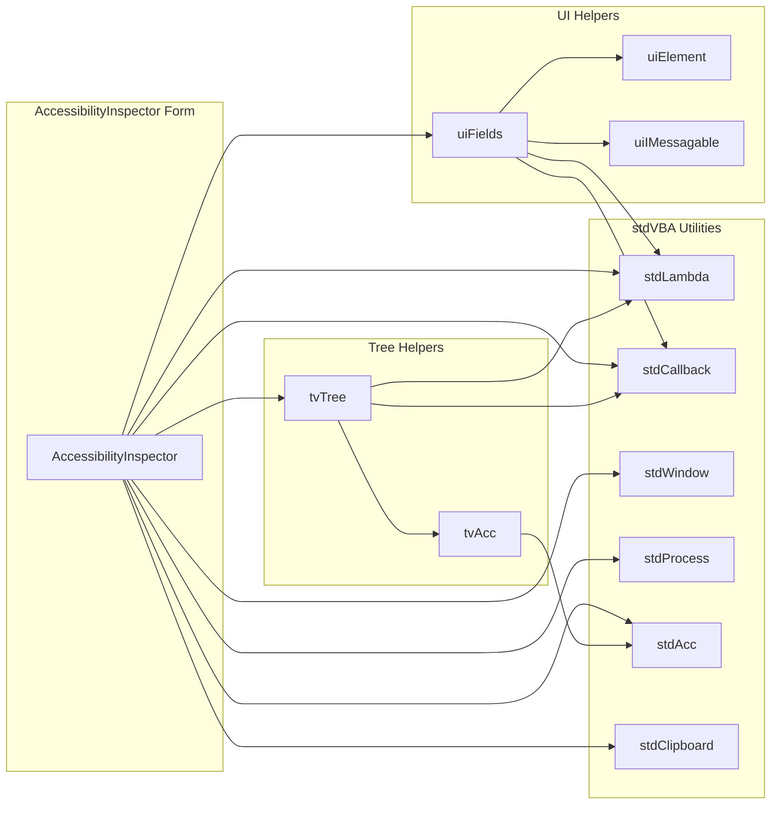

<!--
    {
        "description": "Accessibility Inspector",
        "tags":["ui", "window", "automation", "embedding"],
        "deps":["stdAcc", "stdProcess", "stdWindow", "stdICallable"]
    }
-->

# Accessibility Inspector

While using `stdAcc` it is often useful to be able to obtain the accessibility information at the cursor. This can help you find elements to further investigate the accessibility tree. This example provides a utility application which can be used to:

* Pinpoint element attributes to assist during automation.
* Allows setting of `accValue`, typically useful to test setting fields with information.
* Allows execution of `DoDefaultAction`.

## Requirements

* [stdVBA](http://github.com/sancarn/stdVBA)
    * stdAcc
    * stdCallback
    * stdClipboard
    * stdICallable
    * stdImage
    * stdLambda
    * stdProcess
    * stdShell
    * stdWindow
* tvTree
* uiVBA
    * uiElement
    * uiMessagable
* Currently only works on Windows OS

## Usage

Open xlsm and click "Show Accessibility Inspector"!

Navigate the treeview to insect the accessibility information of desktop windows.

## Roadmap

* [X] Extract basic accessibility information
* [X] Provide watchable cursor option.
* [X] Provide a temporary watchable cursor option ( 5 second timeout ).
* [X] Make form topmost
* [X] Code generation algorithm to generate stdAcc code for usage in user applications.
* [X] Search function to allow searching of accessibility tree.
* [X] Ability to only show visible elements.
* [X] Option to highlighting the selected accessibility element with a yellow rect.
* [ ] Option to find and display the hovered element within the accessibility tree.

## High Level Process

## Project Structure

