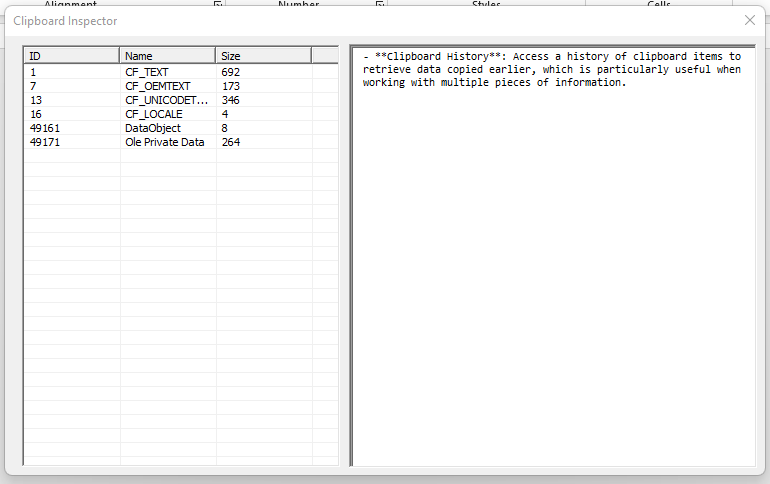
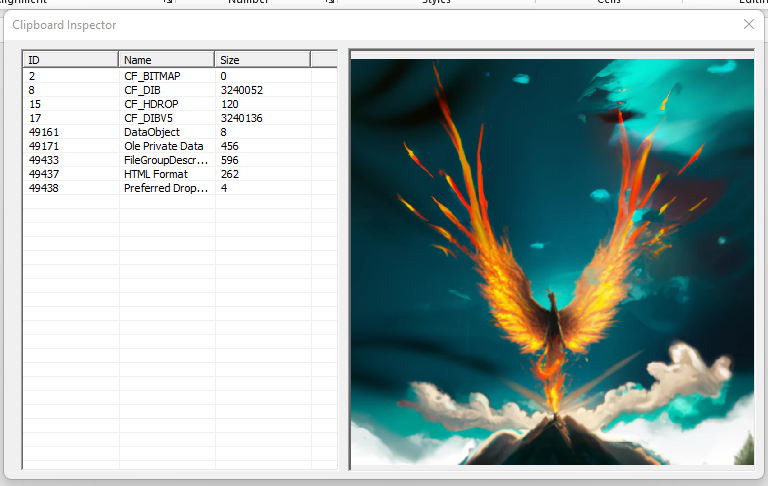

# Clipboard Inspector

## Background

A **Clipboard Inspector** is a tool or utility that allows users and developers to monitor and inspect the contents of the system clipboard in real-time. While most users interact with the clipboard through basic operations like cut, copy, and paste, a Clipboard Inspector provides a deeper insight into what data is currently stored and how it's formatted.

For those already familiar with the clipboard's basic functionality, a Clipboard Inspector extends its utility by offering:

- **Real-Time Monitoring**: See live updates of the clipboard content whenever it's changed, allowing for immediate verification of copy and paste operations.
- **Data Format Inspection**: View all the different data formats that the clipboard is currently holding. The clipboard can store data in multiple formats simultaneously (e.g., plain text, rich text, images), and understanding these formats is crucial for debugging and development.
- **Debugging Tool**: For developers, especially those creating applications that interact with the clipboard, a Clipboard Inspector is invaluable for testing how data is copied to and from the clipboard. It helps in ensuring that the application correctly handles various data formats.
- **Security Auditing**: Monitor the clipboard to ensure that sensitive information is not inadvertently left accessible. This is important because some applications may have access to clipboard data, posing a potential security risk.

By providing visibility into the clipboard's inner workings, the Clipboard Inspector empower users to have greater control and knowledge over what data is stored in the clipboard and how it works.

## TODO List

- [X] Clipboard Monitoring
- [X] Show all formats available on clipboard
- [X] Show images copied to clipboard as images in the viewer
- [ ] Clipboard History

