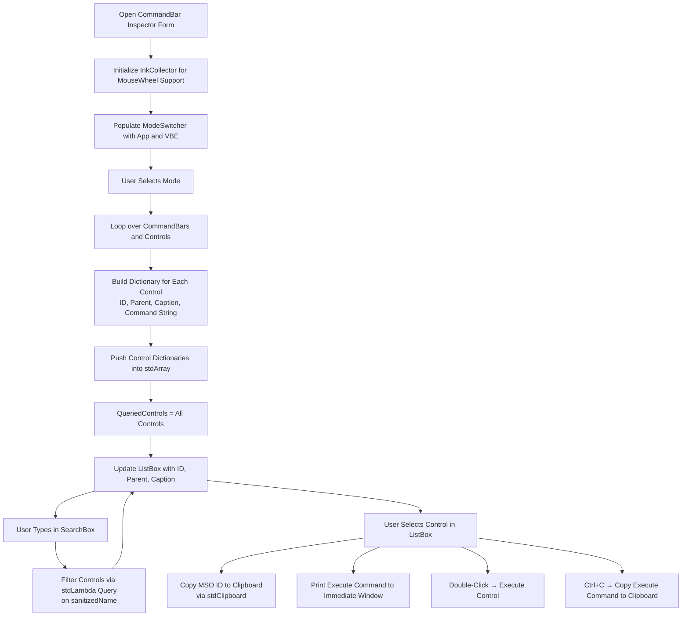
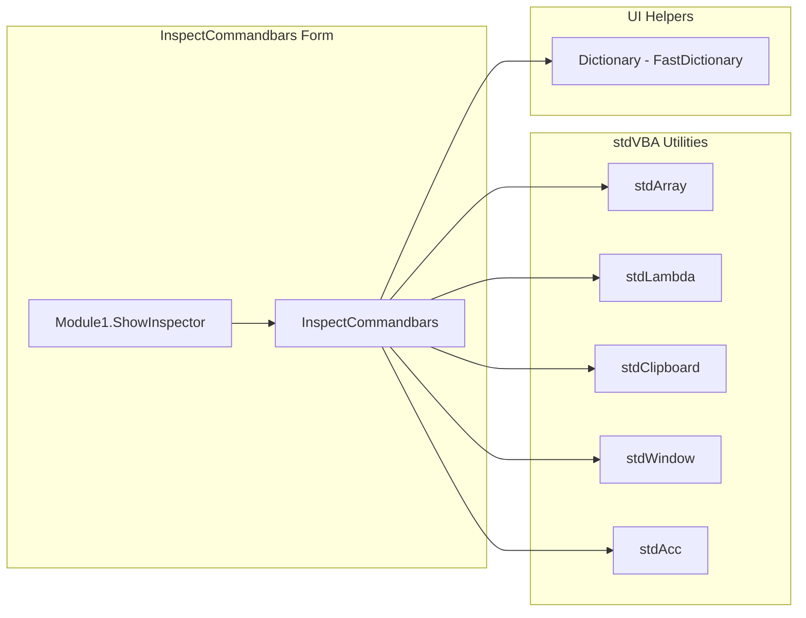

# CommandBar Inspector

CommandBar Inspector is a utility designed for VBA developers and Office power users to explore and inspect the internal `CommandBar` structure of Microsoft Office applications, such as Excel. It provides quick access to `CommandBar` IDs and labels for use in customization, automation, or troubleshooting.

## Features

* 🔍 Searchable Interface: Filter `CommandBars` and controls by name or ID.
* 📋 Copy MSO ID: Easily copy the internal MSO control ID for Ribbon or CommandBar customization.
* 🖱 Execute via Double-Click: Double-click a row to execute the corresponding control.
* 🖨 Print: Copy (ctrl+c) or print VBA to execute the command bar control to the clipboard.
* 📄 Support for Multiple Contexts: Switch between `Application.CommandBars` and `Application.VBE.CommandBars`!

## How to Use

1. Open the workbook
2. Ensure macros are enabled
3. Press the button on the main sheet.
4. Search/Find a command bar you want to use

## High Level Process

## Project Structure

