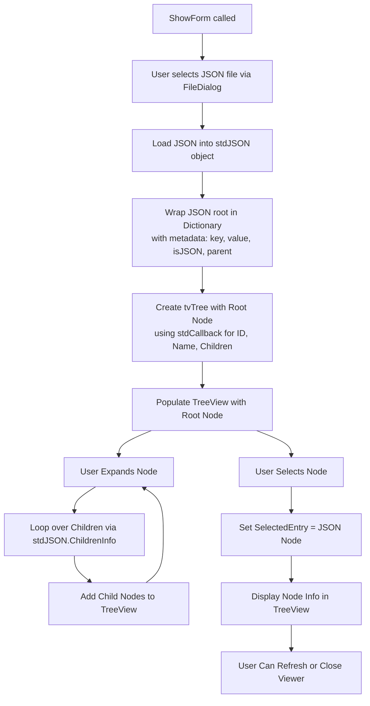
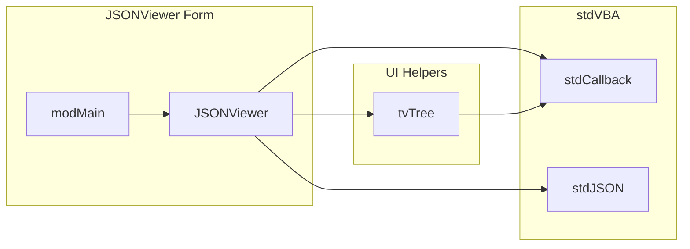

# JSON Viewer

## Usage

1. Click `Show JSON viewer` button.
2. Select the JSON file to view.
3. View the data in the form.

## High Level Process

```mermaid
flowchart TD
    A[ShowForm called] --> B[User selects JSON file via FileDialog]
    B --> C[Load JSON into stdJSON object]
    C --> D[Wrap JSON root in Dictionary<br/>with metadata: key, value, isJSON, parent]
    D --> E[Create tvTree with Root Node<br/>using stdCallback for ID, Name, Children]
    E --> F[Populate TreeView with Root Node]
    F --> G[User Expands Node]
    G --> H[Loop over Children via stdJSON.ChildrenInfo]
    H --> I[Add Child Nodes to TreeView]
    I --> G

    F --> J[User Selects Node]
    J --> K[Set SelectedEntry = JSON Node]
    K --> L[Display Node Info in TreeView]
    L --> M[User Can Refresh or Close Viewer]
```

## Project Structure

```mermaid
flowchart LR
    subgraph BaseLibraries[stdVBA]
        SCB[stdCallback]
        SJ[stdJSON]
    end

    subgraph UIHelpers[UI Helpers]
        TV[tvTree]
    end

    subgraph JSONViewerForm[JSONViewer Form]
        JV[JSONViewer]
        MM[modMain]
    end

    %% Dependencies
    MM --> JV
    JV --> SJ
    JV --> TV
    JV --> SCB

    TV --> SCB
```