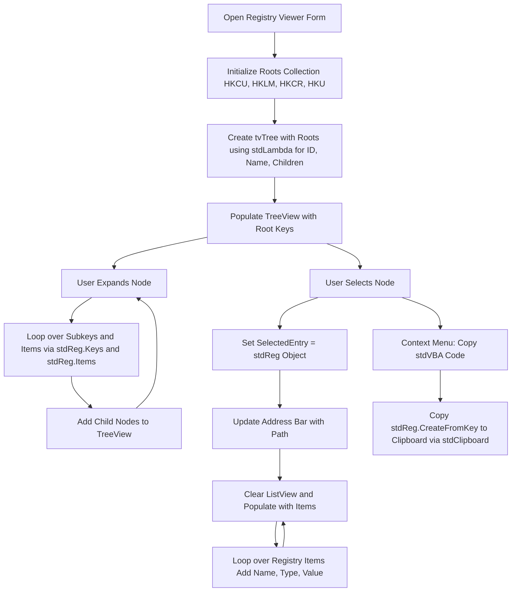
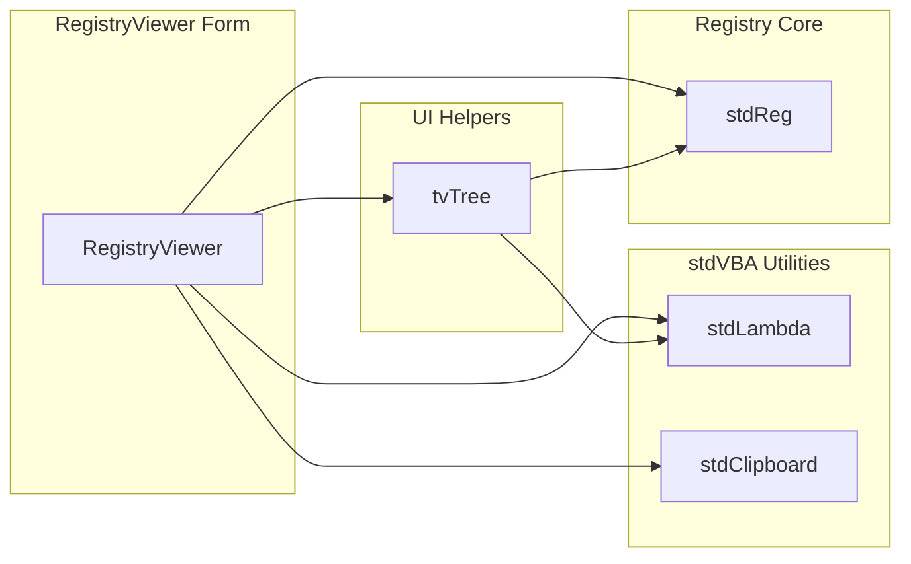

# Registry Viewer

## Usage

1. Click `Show Registry Viewer` button
2. Search the tree.

You can also copy the stdVBA code for selecting the registry key.

## High Level Process

## Project Structure

