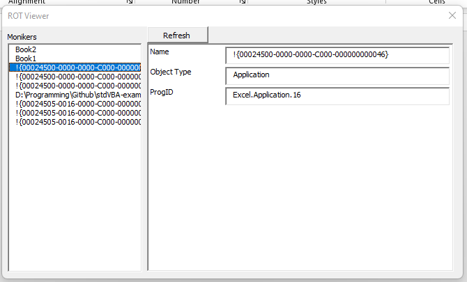
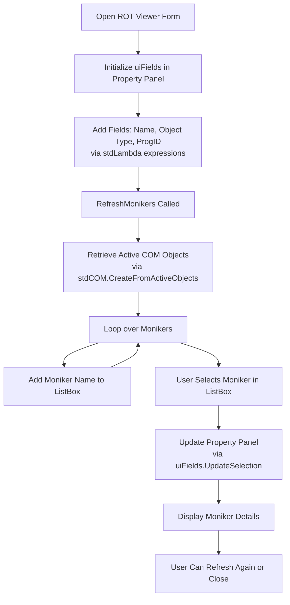
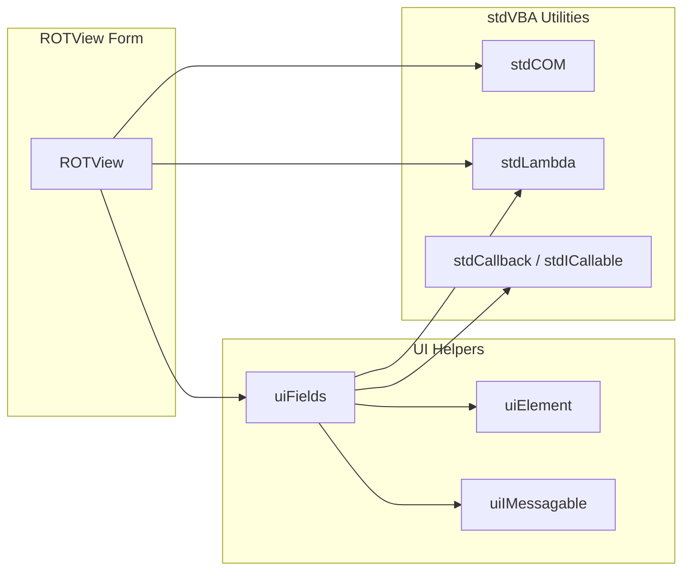

# Running Object Table (ROT) Viewer

## Background

The **Running Object Table (ROT)** is a system-wide lookup table provided by the Component Object Model (COM) in Microsoft Windows operating systems. It keeps track of all the COM objects that are currently running and have registered themselves in the ROT. This allows different processes to discover and access shared COM objects, facilitating inter-process communication and object reuse.

When a COM object is registered in the ROT, other COM-aware applications can obtain a pointer to that object using a `moniker`, an object  is a name that uniquely identifies the object across the system. This is particularly useful for applications that need to interact with or control other running applications or services. This is the same name which can be used in VBA's `GetObject()` API.

A **ROT Viewer** is a diagnostic tool that allows developers and system administrators to inspect the contents of the Running Object Table. By using a ROT Viewer, you can:

- **List Registered COM Objects**: See all the COM objects currently registered in the ROT.
- **Inspect Object Details**: View detailed information about each object, such as its moniker name and the process ID where it is running.
- **Debug COM Registration Issues**: Identify problems where a COM object might not be properly registered or accessible to other processes.
- **Monitor System Behavior**: Understand how applications are interacting with each other through COM objects, which is helpful for performance tuning and security auditing.

Understanding how the ROT works and being able to inspect it is essential for developers working with COM technologies, especially when dealing with complex applications that require robust inter-process communication.

Additionally this example serves as a demonstration of how to use `stdCOM.CreateFromActiveObjects()`, a method which returns a `Collection` of objects containing moniker details.

## High Level Process

## Project Structure

