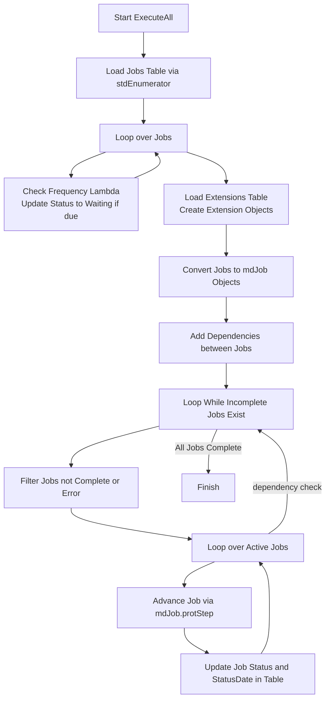
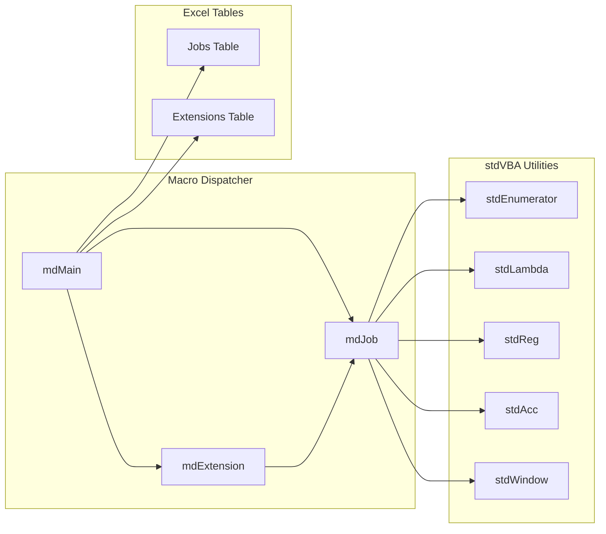

# Macro Dispatcher

Define exactly which macros should be run in which particular order across multiple spreadsheets. Monitors success and errors.

Say we have 4 macro workbooks, each containing macros which refresh some dataset within them:

* `FIN`: `Finances.xlsm` - A raw financial export from our source systems. To refresh run the "Refresh" macro.
* `Proj`: `Projects.xlsm`  - A list of company improvment projects, uses financial information from `financial.xlsm`. To refresh run the "Refresh" macro.
* `OPR`: `Operational.xlsm` - Produces a list of business operational risks, uses information from `Projects.xlsm`.  To refresh run the "RefreshReport" macro. The macro runs and saves the operational report to another drive.
* `AHR`: `AssetHealth.xlsm` - File on sharepoint containing a list of Asset Health Risks, uses information from `Projects.xlsm` and an output from `Operational.xlsm`.  To refresh run the "RefreshDatasets" macro.

```
      FIN
     /   
   Proj   
  /  |   
OPR  | 
   \ |
    AHR
```

From this we can see that `FIN` should be run first, Then `Proj`, Then `OPR`, Then `AHR`. Typically this is where users would follow a process of opening workbooks and refreshing workbooks one by one, but what if we wanted to automate this process? Enter stage... Macro Dispatcher!

First we have to list our workbooks, macro names and dependencies.

| ID   | Workbook                     | Macro           | Dependencies | ReadOnly | CheckOut/In | Status | StatusDate | Frequency Lambda | Comment |
|------|------------------------------|-----------------|--------------|----------|-------------|--------|------------|------------------|---------|
| FIN  | C:\...\Finances.xlsm         | Refresh         |              | false    | false       | Ready  | 01/01/2023 | true             |         |
| Proj | C:\...\Projects.xlsm         | Refresh         | FIN          | false    | false       | Ready  | 01/01/2023 | true             |         |
| OPR  | C:\...\Operational.xlsm      | RefreshReport   | Proj         | true     | false       | Ready  | 01/01/2023 | true             |         |
| AHR  | https://.../AssetHealth.xlsm | RefreshDatasets | Proj,OPR     | false    | true        | Ready  | 01/01/2023 | true             |         |

The header names mean the following:

<table>
  <tr>
    <th>Name</th>
    <th>Type</th>
    <th>Description</th>
  </tr>
  <tr>
    <td>ID</td>
    <td>String</td>
    <td>A unique identifier for the file.</td>
  </tr>
  <tr>
    <td>Workbook</td>
    <td>String</td>
    <td>A path to the workbook containing macro.</td>
  </tr>
  <tr>
    <td>Macro</td>
    <td>String</td>
    <td>The name of the macro to run within the workbook.</td>
  </tr>
  <tr>
    <td>Dependencies</td>
    <td>String</td>
    <td>Comma delimited list of dependencies to ensure are complete before running this macro.</td>
  </tr>
  <tr>
    <td>ReadOnly</td>
    <td>Boolean</td>
    <td>Whether the macro being run can run in read-only mode. If TRUE the workbook will be opened in read-only mode.</td>
  </tr>
  <tr>
    <td>CheckOut/In </td>
    <td>Boolean</td>
    <td>If the workbook is on sharepoint, and would be modified during runtime of the macro, then check-in and check-out might be required. State TRUE if it is and where WRITE permission is required. FALSE otherwise.</td>
  </tr>
  <tr>
    <td>Status</td>
    <td>String</td>
    <td>The status of the extraction.</td>
  </tr>
  <tr>
    <td>StatusDate</td>
    <td>DateTime</td>
    <td>Date the the status was written.</td>
  </tr>
  <tr>
    <td>FrequencyLambda</td>
    <td>String</td>
    <td>"true" if this should be run every time the workbook is run. However you might want to only run once a month, or similar. If you want to ensure this is run only after 1 month has expired (every 30 days)  use the following "now() - $1 > 30"</td>
  </tr>
  <tr>
    <td>Comment</td>
    <td>String</td>
    <td>Any arbitrary comments.</td>
  </tr>
</table>

Now when we click Execute, each macro will be run when it is able to, fully automatically. Multiple workbooks will be ran in parallel too, allowing faster runtimes.

## High Level Process



## Project Structure

