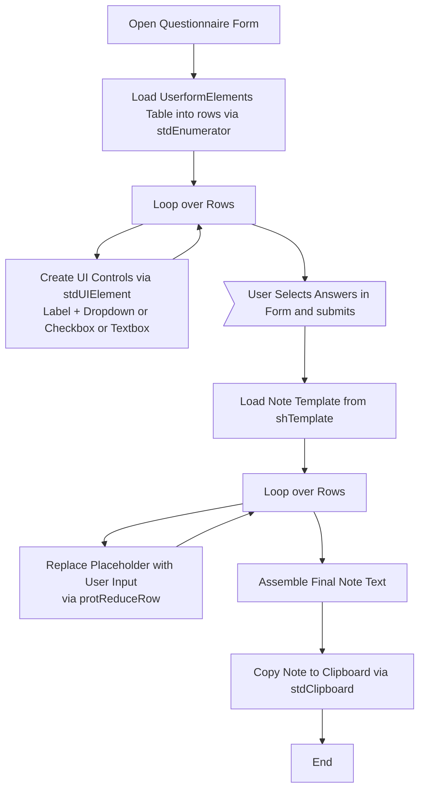
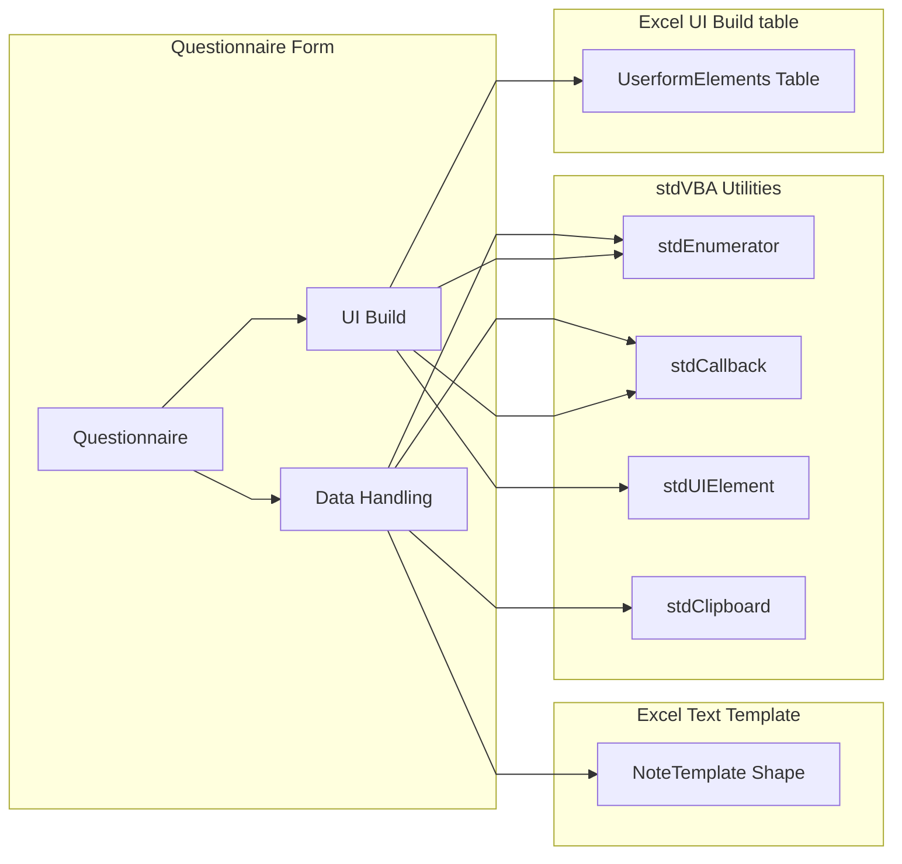

# NoteBuilder

A simple note-builder driven by stdVBA. 

# Spec

We define some questions to be asked to the user

| TemplateName   | Type     | Userform-Description    | dropdown-choices                       | checkbox-yes-text                       | checkbox-no-text |
| -------------- | -------- | ----------------------- | -------------------------------------- | --------------------------------------- | ---------------- |
| issue          | Dropdown | Issue Type              | flooding;smell;pollution               | N/A                                     | N/A              |
| cause          | Dropdown | Cause Type              | blockage;collapse;hydraulic incapacity | N/A                                     | N/A              |
| custVulnerable | Checkbox | Is customer vulnerable? | N/A                                    |  Customer is vulnerable.                |                  |
| job-raised     | Dropdown | Job raised              | jetting;pipe repair                    | N/A                                     | N/A              |
| capex-required | Checkbox | Is CAPEX required?      | N/A                                    |  CAPEX Required. Raised on risk system. |                  |

We present a userform to the user to select answers to the questions, and generate some note out the backend from a template already provided in a textbox.

Inspiration: https://www.reddit.com/r/vba/comments/1ixxv6u/is_there_something_we_can_just_pay_someone/

## High Level Process

## Project Structure

