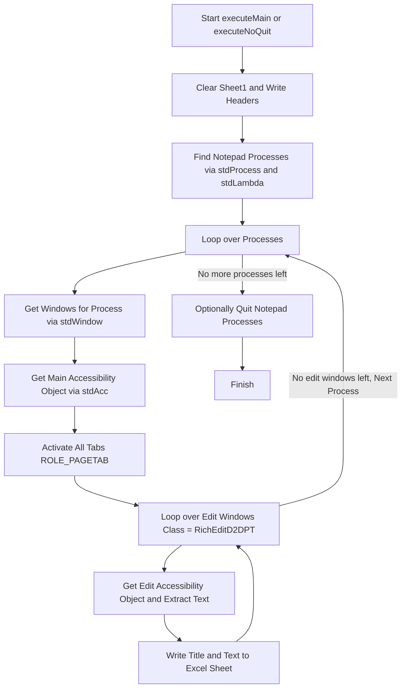
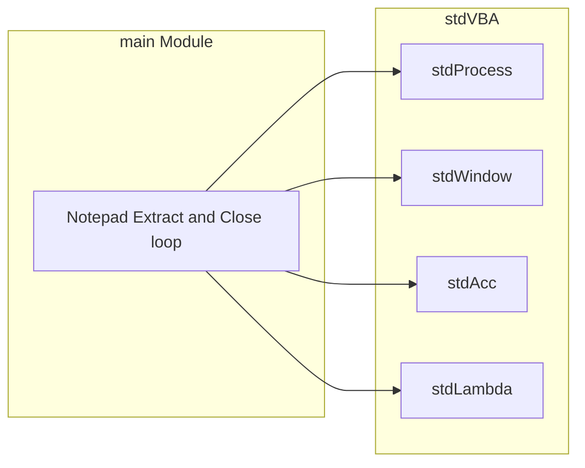

# Notepad Extract and Close

This example demonstrates how to extract all text from all open Notepad windows and close them afterwards.

## Requirements

* stdVBA
    * stdProcess
    * stdWindow
    * stdAcc
    * stdLambda
    * stdICallable

## High Level Process

## Project Structure

