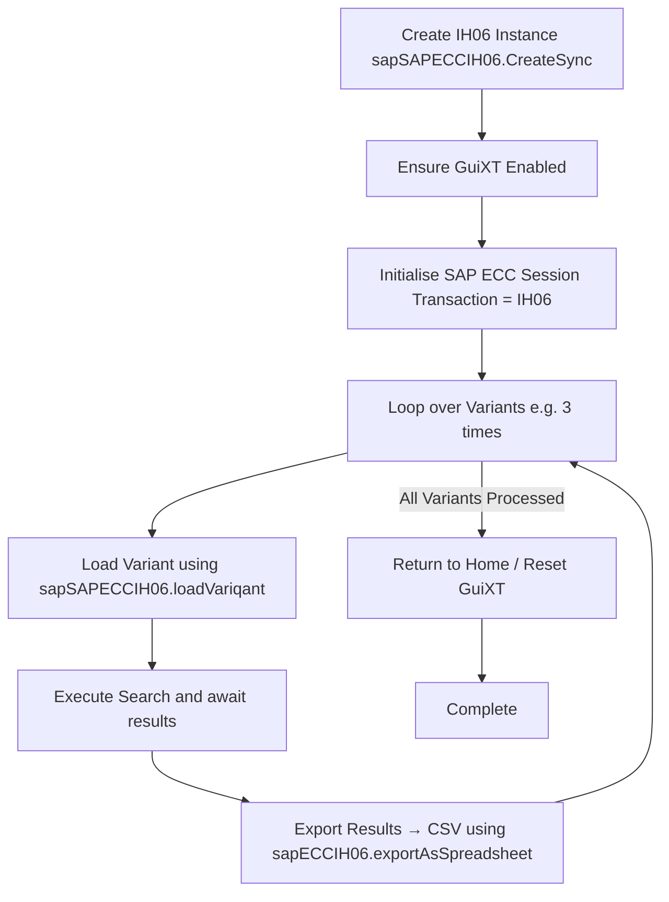
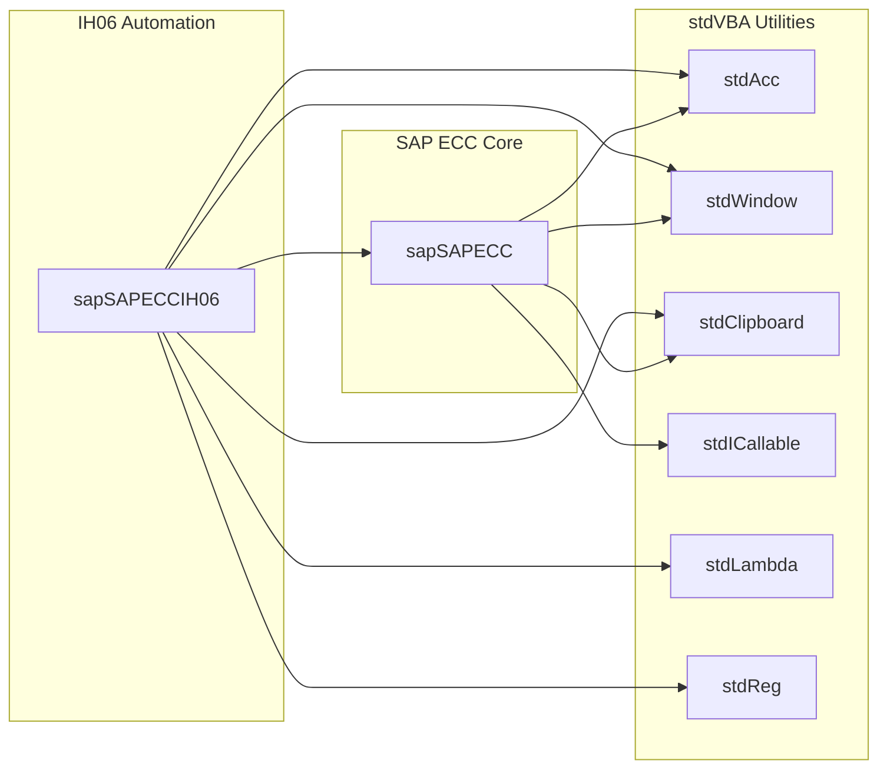

# SAP ECC Automation

Sometimes it is necessary to automate SAP in environments where SAP GUI Scripting is locked down/disabled. This library can be used to automate SAP GUI in these conditions.

## Typical usage

I've used these libraries mostly to perform extraction tasks:

* Extract SAP Notification long text (Service and PM)
* Extract SAP Order long text
* Extract tables from IH06
* Extract information from address form from functional locations in IH06

I would generally advise against using this library for any tasks which update financial information. Do so at your own risk.

## Note:

In order to use the library you can either Create a VBA instance of SAP ECC from existing SAP window, or a new process. To create a new process the current library expects you to launch SAP ECC from a Web URL. You may want to use a different mechanism. Ideally this library would accommodate for that but without experience what that looks like I do not have the ability to build such a routine. E.G. I know some people need to use user/password.

## Library dependencies

### Base:

* stdICallable
* stdAcc
* stdWindow
* stdClipboard
* stdLambda

### With Async:

Additional modules are required for asynchronous processing. Asynchronous processing allows you to automate multiple SAP windows at once. Care must be had while doing these kind of operations though as SAP is glitchy and often actions aren't registered.

* stdFiber
* stdProcess
* stdCallback

## High Level Process

Typical process flow for loading and exporting several variants from IH06:

## Project Structure

