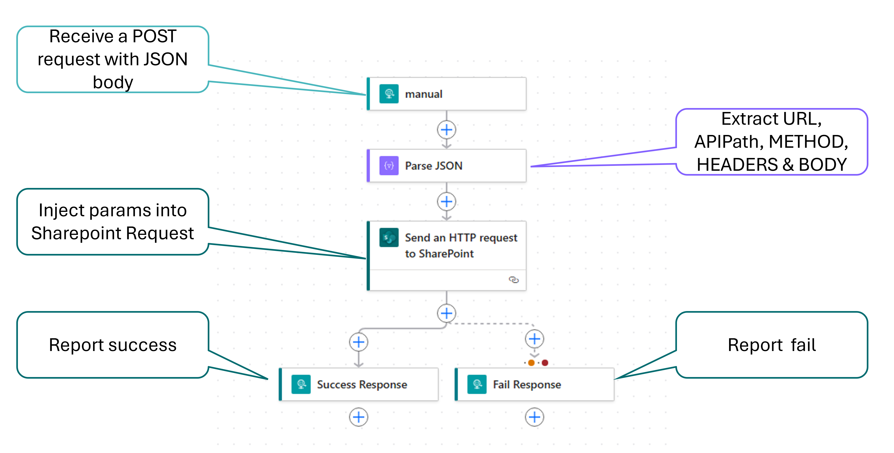
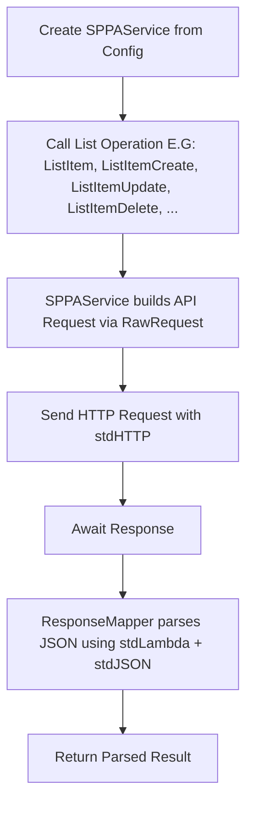
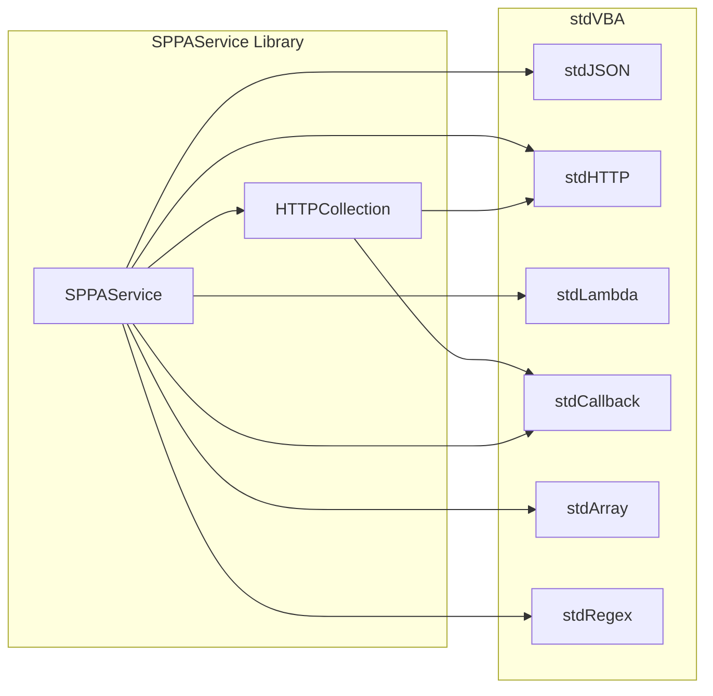

# Sharepoint PowerAutomate Service

## Premise

When dealing with the Sharepoint REST API, handling authentication can be a pain, especially for desktop applications. Authenticating with OAUTH2.0 usually requires setting up a whole server on the host machine in order to receive the OAUTH `key` and `secret`. This can be extremely cumbersome. But there is another way.

Using PowerAutomate you can host PUBLIC REST APIs using the "When a HTTP request is received" trigger. This will give you a URL like the below:

```
https://prod-152.westeurope.logic.azure.com:443/workflows/4d1d1f8773db400cb393f5c34be37ac3/triggers/manual/paths/invoke?api-version=2016-06-01&sp=%2Ftriggers%2Fmanual%2Frun&sv=1.0&sig=XyZ1lP_mNa82VccFJ6RqbTXZd-7rWxjuA3tGhkypOEs
```

The URL can be called with whatever data you need directly from your desktop application.

PowerAutomate can also make calls directly to sharepoint using the "Send an HTTP request to SharePoint" flow.

Utilising these 2 technologies we can publish a URL to push/pull data to/from sharepoint from any application.

> ⚠️⚠️⚠️ DO NOT PUBLISH URLs publically/online without MAJOR RESTRICTIONS on the API usage! ⚠️⚠️⚠️
>
> Generic sharepoint REST APIs like the one used in this demo should remain internal only, and other access controlls should be put in place to ensure unintended usage not possible. These links can be eaily abused in the wrong hands.

## Setup

The basic setup for the Sharepoint service in Power Automate is as follows.



The VBA library in this project (`SPPAService`) can then be utilised to make changes to sharepoint via the copied service URL.

It is advised to save the service urls in **config files**, such that they are not distributed directly with the code. This will prevent accidental sharing of the `SPPAService` URL, thus also preventing abuse from 3rd parties.

## Library usage

### Create a `service` object

When you are initially setting up a service it is suggested you create an object with the following:

```vb
Dim service as SPPAService: set service = SPPAService.Create( _
  "https://prod-152.westeurope.logic.azure.com:443/workflows/.../triggers/manual/paths/invoke?...", _ 'From PowerAutomate service
  "http://tenant.sharepoint.com/sites/Path/To/Site", _
  "My List Name" _
)
```

However do not leave this in your codebase. As suggested above, save this either to a combined config file, or to a seperate service and dataset config file:

```vb
'To combined config
Call service.ToCombinedConfig("C:\Temp\Path_To_Site - My List Name.json")

'Or to seperate configs for the service (worker) and list/document library
Call service.ToWorkerConfig("C:\Temp\PAService.json")
Call service.ToListLibConfig("C:\Temp\Path_To_Site - My List Name.json")
```

After this has been done, replace your service creation code with either of the 2 following snippets:

```vb
'From combined config
Dim service as SPPAService: set service = SPPAService.CreateFromCombinedConfig( _
  "C:\Temp\Path_To_Site - My List Name.json" _
)

'--- or ---

'From Worker and ListLib configs
Dim service as SPPAService: set service = SPPAService.CreateFromConfigs( _
  "C:\Temp\PAService.json", _
  "C:\Temp\Path_To_Site - My List Name.json" _
)
```

This gives your vba workbook the highest security to prevent accidental distribution of the service worker.

### Create items in bulk

```vb
Sub TestListItemsCreateBulk()
  Dim lo as ListObject: set lo = Sheet1.ListObjects("Finances")
  Dim v: v = lo.DataBodyRange.value
  Dim iTitle as long: iTitle = lo.ListColumns("Title").index
  Dim iCost as long:  iCost  = lo.ListColumns("Cost").index

  Dim service As SPPAService
  Set service = SPPAService.CreateFromCombinedConfig("C:\Temp\SPPAService_TacticalData-Test.json")

  Dim items As stdArray: Set items = stdArray.Create()
  For i = 1 To ubound(v, 1)
    With stdJSON.Create()
      .Add "Title", v(i, iTitle)
      .Add "Cost", v(i, iCost)
      Call items.Push(.ToSelf())
    End With
  Next

  Dim x As stdArray: Set x = service.ListItemsCreateBatch(items)

  'TODO: This results object will hopefully be improved to provide more opportunities for interrogation.
  Dim results as string: results = x.map(stdLambda.Create("$1.Await().ResponseText")).join(vbCrLf & vbCrLf)
End Sub
```

### Update items in bulk

```vb
Sub TestListItemUpdateBulk()
  Dim lo as ListObject: set lo = Sheet1.ListObjects("Finances")
  Dim v: v = lo.DataBodyRange.value
  Dim iID as long: iID = lo.ListColumns("ID").index
  Dim iTitle as long: iTitle = lo.ListColumns("Title").index
  Dim iCost as long:  iCost  = lo.ListColumns("Cost").index

  Dim service As SPPAService
  Set service = SPPAService.CreateFromCombinedConfig("C:\Temp\SPPAService_TacticalData-Test.json")

  Dim items As stdArray: Set items = stdArray.Create()
  For i = 1 To ubound(v, 1)
    With stdJSON.Create()
      .Add "id", v(i, iID)
      With .addObject("data")
        .Add "Title", v(i, iTitle)
        .Add "Cost", v(i, iCost)
      End With

      Call items.Push(.ToSelf())
    End With
  Next

  Dim x As stdArray: Set x = service.ListItemsUpdateBatch(items)

  'TODO: This results object will hopefully be improved to provide more opportunities for interrogation.
  Dim results as string: results = x.map(stdLambda.Create("$1.Await().ResponseText")).join(vbCrLf & vbCrLf)
End Sub
```

### Delete items in bulk

```vb
Sub TestListItemDeleteBulk()
  Dim lo as ListObject: set lo = Sheet1.ListObjects("Finances")
  Dim v: v = lo.DataBodyRange.value
  Dim iID as long: iID = lo.ListColumns("ID").index
  Dim iToDelete as long: iToDelete = lo.ListColumns("ToDelete").index

  Dim service As SPPAService
  Set service = SPPAService.CreateFromCombinedConfig("C:\Temp\SPPAService_TacticalData-Test.json")

  Dim items As stdArray: Set items = stdArray.Create()
  For i = 1 To ubound(v, 1)
    if v(i, iToDelete) then
      Call items.push(v(i, iID))
    End if
  next

  Dim x As stdArray: Set x = service.ListItemsDeleteBatch(items)

  'TODO: This results object will hopefully be improved to provide more opportunities for interrogation.
  Dim results as string: results = x.map(stdLambda.Create("$1.Await().ResponseText")).join(vbCrLf & vbCrLf)
End Sub
```

## High Level Process



## Project Structure

