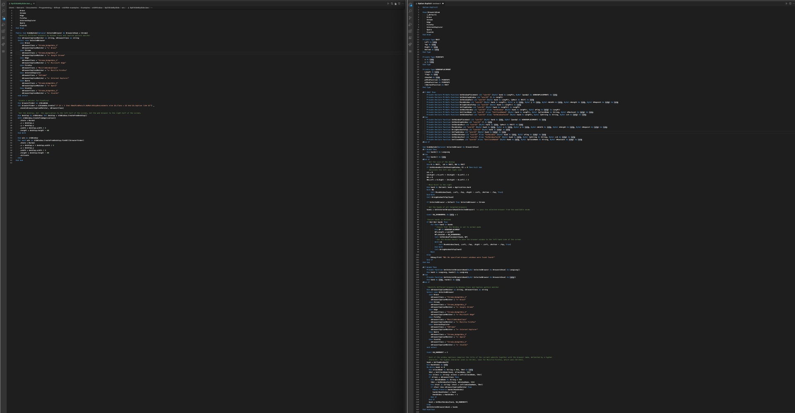

<!--
    {
        "description": "Split windows side by side",
        "tags":["window", "automation"],
        "deps":["stdLambda", "stdWindow", "stdICallable"]
    }
-->

# Excel and Browser side-by-side

Split the screen into 2 halves. The left half should contain the excel window. The right half should contain a browser window of your choosing

## Requirements

* [stdVBA](http://github.com/sancarn/stdVBA)
    * stdICallable
    * stdWindow
    * stdLambda
* Currently only works on Windows OS

## Usage

Ensure a browser window is open when running this code.

```vb
Sub Main()
  Call SideBySide(Edge)
End Sub
```

## Comparison with pure VBA

With `stdVBA` we've trimmed our solution down to 162 lines to about 62. `stdVBA` helps you cut down on boiler plate and helps you focus on the important questions like "How do I move my window" rather than "How do I get the caption text of a window?".


