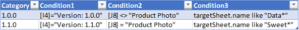
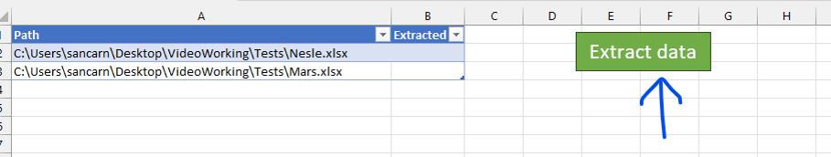
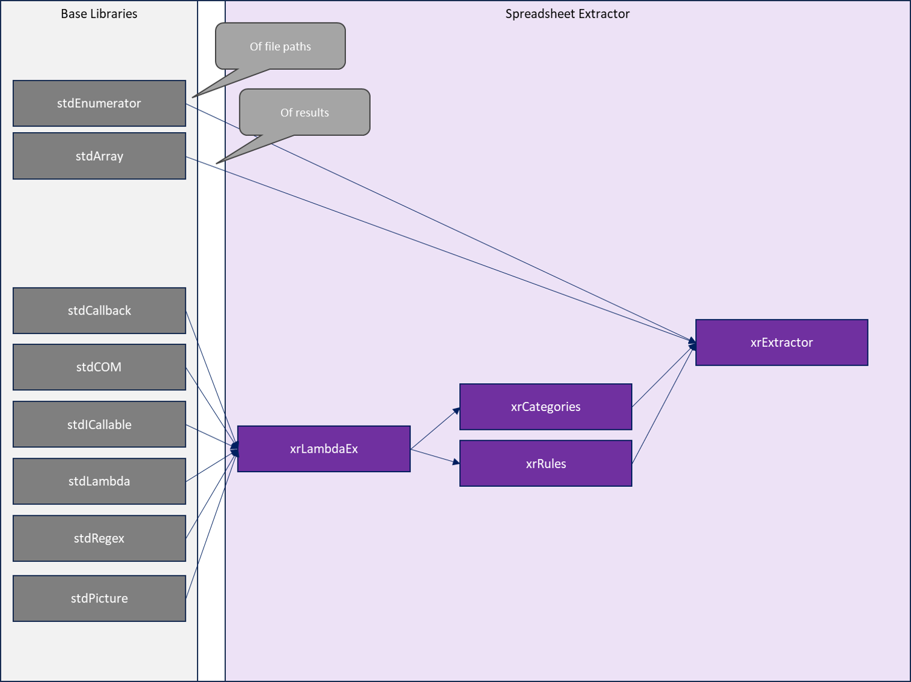

<!--
    {
        "description": "Extract any set of spreadsheets to a table",
        "tags":["extract", "batch", "bulk"],
        "deps":["stdArray", "stdCallback", "stdCOM", "stdEnumerator", "stdICallable", "stdLambda", "stdRegex"]
    }
-->

# Spreadsheet Extractor with stdVBA

An extensible tool which can be used to extract any set of spreadsheets (typically versioned structured storage) to a table

## Requirements

* Currently only works on Windows OS

## Usage

### 1. Overview

The spreadsheet extractor has been built to extract any data from any spreadsheet given user defined conditions. The initial intention of the tool was to aid in the extraction of data from a set of spreadsheets which are version controlled structured data cards, however the tool has been re-created into a general tool with a codebase fit for any data extraction need across a large set of spreadsheets. The tool processes each sheet/tab of every workbook given in `Paths` tab, categorises it using the rules specified in the `Categories` tab and then runs "Extraction Rules" based on the `Rules` tab. The syntax of the rules is a superset of `stdLambda` syntax, with additional injected functions giving it a formula-like feel. The `stdLambda` syntax is loosely based on VBA's syntax. Please see Section 2 for instructions on how to engineer this this spreadsheet to extract data from your spreadsheets.

### 2. Initial Setup

#### a. Set up categories

The initial point of call is to set up the categories which are required for the extraction of your data. Categories are used by the tool to identify specific worksheets of workbooks which require data extraction. Categories have been added to allow you to extract data differently from multiple spreadsheets dependant on their category. For example, categories can be set up to export data from different versions of multiple spreadsheets/cards which otherwise have different layouts and table structures. The rules table can be found on the "Categorisation Rules" spreadsheet.

A typical Categorisation Rules table can be found below.



The headers aren't required in order to make the tool work. It is important that you use the name of your category in the first column (in this case the different versions of the template), and the conditions for your category to the right of this list. Each condition column is `AND`-ed together to define the category. Note you may also use a single column with `AND()` and `OR()` formula. In fact you can use all formula functions and operators built in to Excel to determine these conditions.

In the above case if `I4` is "Version: 1.0.0" and `J8` is not "Product Photo" then the worksheet will be categorised as "1.0.0". Alternatively if `I4` is "Version: 1.1.0" and `J8` is "Product Photo" then the worksheet will be categorised as "1.1.0". If the worksheet matches neither "1.0.0" or "1.1.0" then this worksheet will be skipped, i.e. no data extraction will take place.

> **Note:**
>
> The same category name can be used for multiple different condition sets. 

#### b. Set up the Extraction Rules

Now that we are categorising each worksheet we can begin extracting data from each category. We do this by defining lines in the Rules table. This table is found on the "Rules" tab. As with the categorisation rules any formula functions can be used within the table. The evaluation engine is described in section 4 of this documentation. The important thing to note is that you can export data from the sheet with simple cell references surrounded by square brackets, i.e. `[E11]`. You can also access the targetSheet directly, which gives you access to the worksheet object. You can also access range objects themselves with `r[A1]` for instance.

A typical set of Extraction Rules can be found below:


The column names provided in this table directly correspond to the column names of the table which will appear in the output. Cell references and formula can be used to specify which cells the algorithm should export data from given the sheet for the categories listed on the left. It is important that the Category column remains as the 1st column in this table. All successive columns are user defined.

> **Note:**
>
> Unlike the categorisation rules, there is little reason to extract multiple categories of the same name at once. For this reason it is suggested that all category names in this table are unique, in order to help process data outputs.

### 3. Running data extracts

After categorisation and extraction rules have been implemented, running extractions from cards is easy!

* Navigate to the Paths sheet
* Paste the file paths of all Excel spreadsheets that you want to extract data from.
* Click the run button

The tool will now execute and extract data from all workbook paths where Extracted <> "Yes"



> Note:
> 
> You can quickly produce a file list from a folder in windows explorer by selecting all files you want to analyse, holding down the shift key down, right clicking on a file and selecting the "copy as path" option. This will copy the file paths of all selected paths to the clipboard.

### 4. Formula engine syntax

The syntax of the formula engine is an important part to understand about the way this tool works. The formula engine is an extended version of `stdLambda` who's official documentation can be found here: https://github.com/sancarn/stdVBA/blob/master/docs/stdLambda.md

The sheet which the rule is currently being ran on can be accessed via the variable named targetSheet

A value can be accessed from the sheet using the `[...]` syntax: `[A11]` will extract the data held in `A11` (VBA equivalent of `targetSheet.range("A11").value`).

A range object can be accessed from the sheet using the `r[...]` syntax: `r[A11]` will return a range object for `A11` (VBA equivalent of `targetSheet.range("A11")`).

After a range object has been obtained it can be acted upon, for instance the color of the cell can be obtained via the interior.color property:  `r[A11].interior.color`

Additionally properties of the sheet object can be accessed too. For instance the name of the sheet can be accessed targetSheet.name.
This also allows finding specific text on a sheet: `targetSheet.Find("SomeText")`; or within a range: `r[A1:F22].Find("SomeText")`

Information from the workbook can be found with `targetSheet.parent` e.g. The workbook's name: `targetSheet.parent.name`

You can also access information about the current spreadsheet extractor using  `ThisWorkbook`  e.g. The workbook's name:  `ThisWorkbook.name`

Numerous functions are injected into the runtime of the formula. For instance all functions and properties within `Application.WorksheetFunction` are accessible directly documented [here](https://learn.microsoft.com/en-us/office/vba/api/excel.worksheetfunction).

This allows you to use functions like sum() to sum over a range:  `sum(r[A11:A21])`

Additionally functions defined in `xlLambdaEx` are included in the runtime. This allows further extensibility in the system than what formulae alone can provide. A list of the standard functions is included below.

In some cases more complicated expressions are required. The expression language allows for multiple lines of code within a single expression, either seperated by whitespace or by a `:` character. This means scripts which obtain information can be used.

```ruby
let x = getIntersectingShapes(r[A11:F24])
if x.count = 0 then
  "No shapes"
else
  x.count + " shapes"
end
```

`stdRegex` has been injected into the `xlLambdaEx` runtime, which can be used to extract information from strings.

**Custom Functions included**

```vb
getGUID() as string
  'Generates a new GUID
  '@returns {string} a new random GUID

getIntersectingShapes(rng As Range, Optional exitOnFind As Boolean = False) as Collection<Shape>
  'Obtains a collection of shapes which intersect with a range
  '@param {Range} The range to search for shapes within
  '@param {Optional Boolean=False} Exit on the first shape found. Set this to true if you're only interested in finding 1 shape.
  '@returns {Collection<Shape>} A collection of all intersecting shapes

exportShapeToFile(shp As Shape, sFileDir As String, sFileName As String) as String
  'Exports a single shape to a PNG file.
  '@param {Shape} Shape to export to file as PNG
  '@param {String} Directory to export file to
  '@param {String} New file name
  '@returns {String} The full file path of the newly created PNG

exportShapeCollectionToFiles(shapes As Collection, sFileDir As String, sBaseName As String) As String
  'Exports a collection of shapes to a PNG files.
  '@param {Collection} Collection of shape objects to export to folder of PNG files
  '@param {String} Base directory to create export folder within
  '@param {String} Base name of new files
  '@returns {String} The path to the folder containing all exported images
  '@example ShapeCollectionToFiles(getIntersectingShapes(r[A1:M24]), "C:\Temp", "Image")

OffsetMerged(rng As Range, Optional rows As Long = 0, Optional cols As Long = 0) As Range
  'Like `WorksheetFunction.Offset` but considers merged cells, which can be very useful when working with structured data formats.
  '@param {Range} The range to perform the offset on
  '@param {Long=0} Number of merged rows to offset by
  '@param {Long=0} Number of merged columns to offset by
  '@returns {Range} The resulting range after offsetting by merged rows and columns.
```

### 5. Extensibility

In order to extend the functionality with custom functions, add custom functions to `xrExtractor.cls`. These will be imported dynamically into the formula engine.

### 6. Project structure

At a high level:

* `xrExtractor` module is the main entry point for this tool
* `xrExtractor` receives a stdEnumerator of file path entries from Paths table.
* `xrExtractor` also creates a stdArray which all results are pushed toward.
* With each path, `xrExtractor` opens the workbook and for each sheet in the workbook it runs:
  * `xrCategories` is run defining the category of the workbook from rules established in Categories table
  * If a category is found then `xrRules` are ran to extract an object containing results information.
* Both `xrCategories` and `xrRules` use `xrLambdaEx` as their calculation engine.
* `xrLambdaEx`:
  * Is a wrapper around `stdLambda`
  * Extends `stdLambda` with functions from within WorksheetFunctions
    * Each function is wrapped with stdCallback
  * Extends `stdLambda` with functions defined within `xrLambdaEx` (for extensibility)
    * Similarly, each function is wrapped with stdCallback
  * Uses regex to rewrite the syntax `r[A1]` and `[A1]` as `targetSheet.Range("A1")` and `targetSheet.Range("A1").value` respectively.



## Roadmap

* [X] Basic extractor
* [X] Allow extraction of images
* [ ] Allow extraction to multiple tables (i.e. database)
* [ ] Consider different category types, like a cell structure category rather than a sheet category.


## Known issues

TBC

