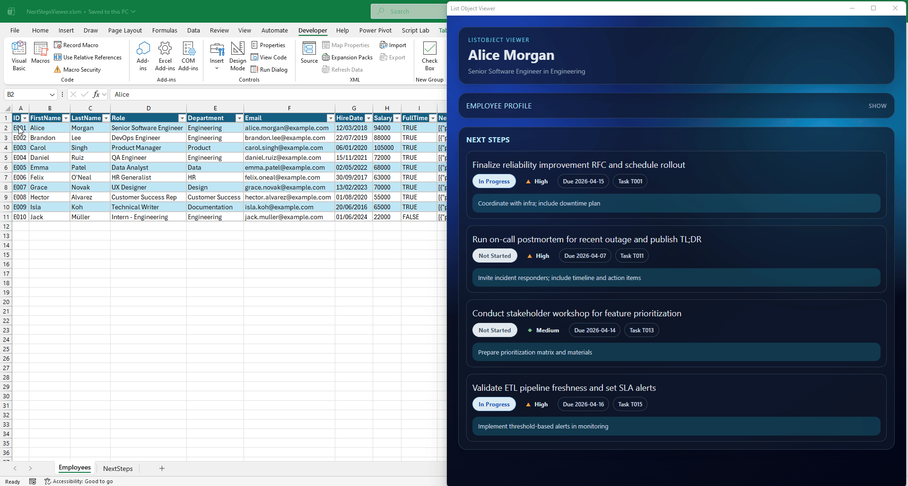

# ListObjectViewer - Example 1

This example shows how to use `stdWebView` in a VBA `UserForm` to render a modern HTML dashboard for the currently selected row in an Excel `ListObject`.

When the selected row changes, VBA pushes the row values to JavaScript as a host object (`listrow`), and the UI refreshes automatically.

## What this example includes

- A `UserForm` (`xlListObjectViewer`) that hosts a WebView and listens to worksheet selection changes.
- A launch macro (`ShowForm`) that opens the viewer and loads `index.html`.
- A polished HTML/CSS/JS dashboard (`index.html`) that renders:
  - Employee profile details
  - A "Next Steps" task list from JSON stored in the selected row
- Sample CSV data in `data/`:
  - `Employees.csv`
  - `NextSteps.csv`

## Requirements

- Windows
- Excel desktop with VBA enabled
- `stdVBA` dependencies used by this example:
  - `stdWebView`
  - `stdWindow`
  - `stdShell`
  - `stdJSON`
  - `stdIShellExtension`
  - `stdICallable`

The required class modules are already included under `src/libs/`.

## Expected workbook setup

This example assumes:

- A worksheet with codename `shEmployees`
- A table named `Employees` on that sheet
- The table includes these columns:
  - `ID`
  - `FirstName`
  - `LastName`
  - `Role`
  - `Department`
  - `Email`
  - `HireDate`
  - `Salary`
  - `FullTime`
  - `NextSteps` (JSON text for one or more tasks)

The UI reads those same field names in JavaScript.

## How to run

1. Open the example workbook (or import the files in `src/` into your workbook).
2. Ensure `index.html` is in the same folder as the workbook.
3. Run macro: `ShowForm` (from `mShowForm`).
4. Click different rows in the `Employees` table.
5. Watch the viewer update with the selected employee and their Next Steps.

## How selection sync works

1. `ShowForm` reads `index.html` and opens `xlListObjectViewer`.
2. The form subscribes to `shEmployees` `SelectionChange`.
3. On each row change, VBA builds a dictionary from the table headers + row values.
4. VBA injects that dictionary into WebView as host object `listrow`.
5. VBA triggers JavaScript event `listrow-changed`.
6. JavaScript reads `chrome.webview.hostObjects.listrow` and re-renders the UI.

## Notes on `NextSteps`

- `NextSteps` should contain JSON text.
- The page accepts either:
  - A single JSON object, or
  - A JSON array of objects
- The renderer is tolerant to common key variants (for example `DueDate`/`dueDate`, `Status`/`status`).

The helper function `udfBuildJSONObject(...)` in `udfs.bas` is provided to simplify generating JSON from worksheet formulas/macros.

## File map

- `src/mShowForm.bas` - entry-point macro
- `src/xlListObjectViewer.frm` - WebView form + worksheet event bridge
- `src/udfs.bas` - JSON helper UDF
- `index.html` - dashboard UI
- `data/*.csv` - sample data
