<!--
    {
        "description": "Embed Microsoft Word into a userform",
        "tags":["ui", "window", "automation", "embedding"],
        "deps":["stdLambda", "stdWindow", "stdICallable", "stdProcess"]
    }
-->

# TextBoxEx for VBA UserForms

This is a text box control which uses a Microsoft Word instance as a userform control. This control offers all the features you get in word, critically **spell checking**.


## Requirements

* [stdVBA](http://github.com/sancarn/stdVBA)
    * stdICallable
    * stdWindow
    * stdProcess
    * stdLambda
* Currently only works on Windows OS

## Usage

Draw a frame on your Userform. The textBox should populate the frame's location and size.

In your form code add the following:

```vb
Private textBox As uiTextBoxEx

Private Sub UserForm_Initialize()
  'Intiialise textbox
  Set textBox = uiTextBoxEx.Create(Me.TextBoxFrame)

  'You can change the text displayed via the Text property. This isn't a requirement
  textBox.Text = "Yo bruva it's ya boy Jamo and I got something really cool to tell ya " & _
                 "It's so cool that you're gunna shizzle ma nizzle isn't it?"
End Sub
```

## Roadmap

* [X] Basic text editing / display
* [ ] Disable-able (read only)
* [X] Is there an easy way to inject and extract formatted text? (Use `OpenXML` property)
    * [ ] Can the OpenXML be simplified?
    * [ ] Make a library to generate OpenXML (for the production of auto-formatters e.g. syntax highlighters)
* [ ] Add a `Textbox.injectToolbar(textBox,frame)` for common commands like `bold`, `italic`, `strikethrough`, `color`, `highlight`, etc. 

## Known issues

* Slow startup
    * Try to avoid create a huge quantity of these textboxes. A brand new word instance is created for each textbox, and that's pretty performance heavy. Instead keep 1 textbox and change the parent of it if necessary.
* Sometimes ui appears to go offscreen and there are potential sizing issues - happy for PRs to correct this.

## High Level Process

```mermaid
%%{init: {"flowchart": {"defaultRenderer": "elk"}} }%%
flowchart TD
    linkStyle default interpolate linear

    A[UserForm Initialize] --> B[Create uiTextBoxEx with Frame]
    B --> C[protInit: Create Word.Application instance]
    C --> D[Add New Word Document]
    D --> E[Configure Word Window<br/>WebLayout, Hide Rulers, Resize to Frame]
    E --> F[Find Word Pane via stdWindow + stdLambda]
    F --> G[Reparent Word Pane into UserForm Frame]
    G --> H[Expose Properties: Text, OpenXML, ReadOnly]
    H --> I>User Interacts with TextBoxEx<br/>Typing, Spellcheck, Formatting]
    I --> J[On Terminate → Quit Word Process via stdProcess]
```



## Project Structure    

